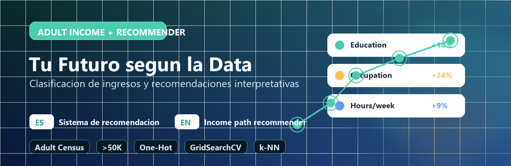

# Sistemas de Recomendacion - Tu Futuro segun la Data



**Idioma / Language:** [English](README.md) | Español

Este proyecto usa el **Adult Income Dataset** para construir un modelo supervisado que estima si una persona adulta podria superar los **50,000 USD anuales**. Sobre esa probabilidad se desarrolla un sistema de recomendacion interpretativo que sugiere trayectorias accionables en educacion, ocupacion, tipo de trabajo y horas semanales.

**English:** This project uses the Adult Income Dataset to estimate whether an adult profile is likely to earn more than 50K USD per year and recommends actionable career or education paths to improve that probability.

## Objetivos

- Explorar los datos del censo.
- Limpiar valores nulos o mal codificados como `?`.
- Transformar variables categoricas con One-Hot Encoding.
- Normalizar variables numericas.
- Entrenar un modelo supervisado de clasificacion.
- Definir y construir un sistema de recomendacion interpretativo.
- Probar recomendaciones con perfiles simulados.

## Problema de recomendacion

- **Que se quiere recomendar:** trayectorias de mejora, como aumentar nivel educativo, orientar la ocupacion hacia areas con mayor probabilidad de ingreso alto, explorar categorias laborales y ajustar disponibilidad horaria.
- **Quien es el usuario:** una persona adulta representada por variables demograficas y socioeconomicas.
- **Variables del perfil:** edad, educacion, ocupacion, estado civil, relacion familiar, horas trabajadas, tipo de trabajo, pais de origen, sexo, raza y variables de capital.
- **Enfoque usado:** sistema hibrido. Combina un clasificador supervisado que estima probabilidad de `>50K` con filtrado basado en contenido mediante vecinos similares de alto ingreso.

## Flujo de trabajo

1. Carga de `data/raw/adult-census-income.csv`.
2. Limpieza de columnas, duplicados y valores `?`.
3. Creacion del target binario `income_high`.
4. Division estratificada en train/test.
5. Preprocesamiento:
   - imputacion de numericas con mediana;
   - escalado con `StandardScaler`;
   - imputacion de categoricas con `Unknown`;
   - codificacion `OneHotEncoder`.
6. Entrenamiento de clasificador base.
7. Optimizacion con `GridSearchCV`.
8. Construccion del recomendador hibrido.
9. Pruebas con perfiles simulados.
10. Guardado del modelo y resultados.

## Estructura

```text
.
├── assets/project-banner.png
├── data/
│   ├── raw/adult-census-income.csv
│   └── processed/
│       ├── train.csv
│       └── test.csv
├── models/
│   ├── adult_income_recommender.joblib
│   ├── adult_income_metrics.json
│   └── sample_recommendations.json
├── src/
│   ├── app.py
│   ├── explore.ipynb
│   └── utils.py
└── requirements.txt
```

## Instalacion

```bash
python -m venv .venv
.\.venv\Scripts\activate
pip install -r requirements.txt
```

En macOS/Linux:

```bash
python -m venv .venv
source .venv/bin/activate
pip install -r requirements.txt
```

## Ejecucion

```bash
python src/app.py
```

El script genera:

- `data/processed/train.csv`
- `data/processed/test.csv`
- `models/adult_income_recommender.joblib`
- `models/adult_income_metrics.json`
- `models/sample_recommendations.json`

## Uso del recomendador

```python
import joblib
import sys

sys.path.append("src")

artifact = joblib.load("models/adult_income_recommender.joblib")
recommender = artifact["recommender"]

perfil_usuario = {
    "age": 25,
    "workclass": "Private",
    "fnlwgt": 180000,
    "education": "HS-grad",
    "education_num": 9,
    "marital_status": "Never-married",
    "occupation": "Adm-clerical",
    "relationship": "Not-in-family",
    "race": "White",
    "sex": "Female",
    "capital_gain": 0,
    "capital_loss": 0,
    "hours_per_week": 25,
    "native_country": "United-States",
}

resultado = recommender.recommend(perfil_usuario)
print(resultado.base_probability)
print(resultado.recommendations)
```
